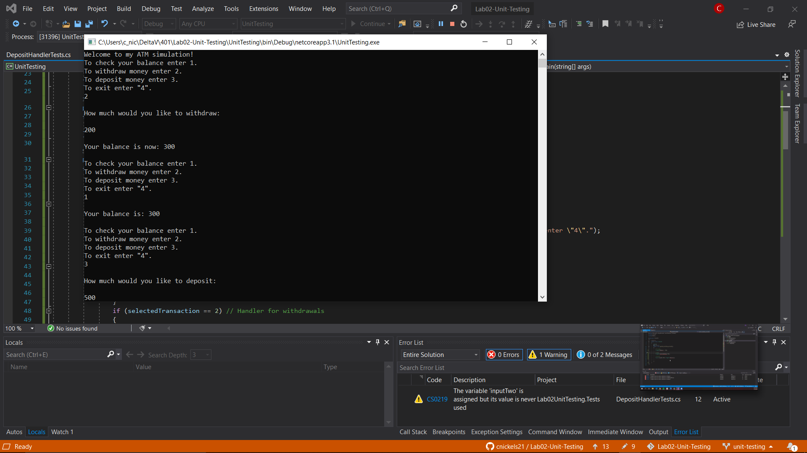
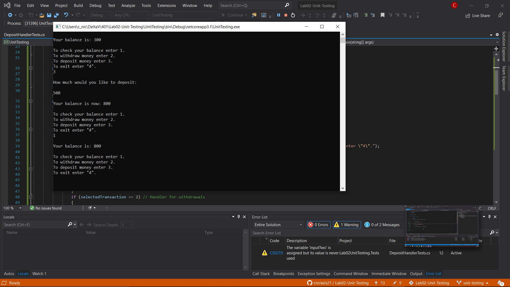

# Lab02-Unit-Testing

Console app to simulate atm transactions utilizing unit testing for development.

## Summary

This is a console app that uses C# in the .NET framework to simulate the functionality of an atm.  Starting with a base user balance, the user can then access the current balance, make a deposit, make a withdrawal, or close the app.

## Approach

Keith has verbally "slapped my wrist" for not following TDD practices, however I ended up only having two methods to test...an addition method and a subtraction method.  I did write a test at the beginning to test that my tests were setup correctly, and I did write one test for my addition method, but after some refactoring those methods are no longer testable as they have evolved to be dependent on user input.

